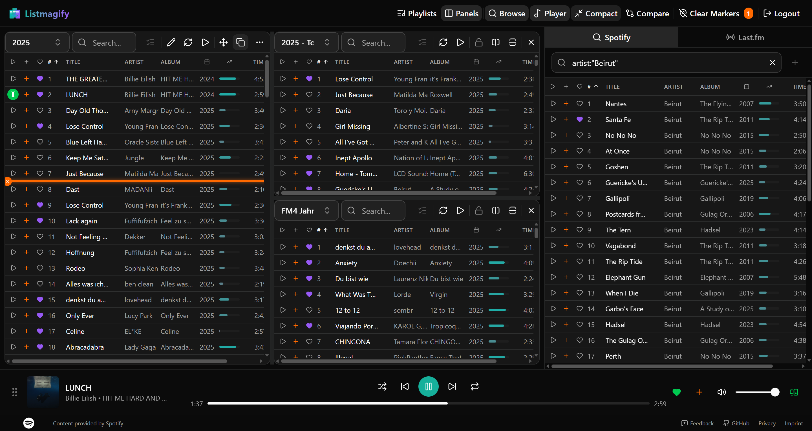

# Listmagify

Playlist magic for Spotify. Edit multiple playlists side-by-side with drag-and-drop, bulk operations, and real-time sync.



## Features

- **Multi-Panel Editor** – Work with multiple playlists simultaneously in split views
- **Drag & Drop** – Move or copy tracks between playlists with visual feedback
- **Smart Search** – Filter tracks instantly by title, artist, or album
- **Bulk Operations** – Select and move/copy/delete multiple tracks at once
- **Liked Songs Browser** – Access your entire library and copy favorites into playlists
- **Track Recommendations** – Get AI-powered suggestions based on your playlist patterns
- **Integrated Player** – Preview tracks without leaving the app
- **Compact Mode** – Dense view to see more tracks on screen

## Production Setup (listmagify.com)

To deploy to production:

1. **Configure Environment Variables**:
   ```env
   NEXTAUTH_URL=https://listmagify.com
   NEXTAUTH_SECRET=your_generated_secret_here
   SPOTIFY_CLIENT_ID=your_client_id
   SPOTIFY_CLIENT_SECRET=your_client_secret
   ```

2. **Update Spotify Dashboard**:
   - Add Redirect URI: `https://listmagify.com/api/auth/callback/spotify`

3. **Build & Run**:
   ```bash
   # Build the production image
   docker build -f docker/Dockerfile.prod -t listmagify .

   # Run the container
   docker run -p 3000:3000 --env-file .env.production listmagify
   ```

## Quick Start (Local)

1. **Set up environment**:
   ```cmd
   run.bat init-env
   ```

2. **Add Spotify credentials** to `.env`:
   ```
   SPOTIFY_CLIENT_ID=your_client_id
   SPOTIFY_CLIENT_SECRET=your_client_secret
   NEXTAUTH_SECRET=your_random_secret
   ```

3. **Configure OAuth** in [Spotify Developer Dashboard](https://developer.spotify.com/dashboard):
   - Redirect URI: `http://127.0.0.1:3000/api/auth/callback/spotify`

4. **Run**:
   ```bash
   # Windows
   run.bat install
   run.bat up

   # macOS/Linux
   ./run.sh install
   ./run.sh up
   ```

5. Open [http://127.0.0.1:3000](http://127.0.0.1:3000)

## Development

All commands run inside Docker:

| Task | Windows | macOS/Linux |
|------|---------|-------------|
| Install dependencies | `run.bat install` | `./run.sh install` |
| Start dev server | `run.bat up` | `./run.sh up` |
| Stop dev server | `run.bat down` | `./run.sh down` |
| Run unit tests | `run.bat test` | `./run.sh test` |
| Run E2E tests | `run.bat test e2e` | `./run.sh test e2e` |
| Add package | `run.bat dev pnpm add <pkg>` | `./run.sh exec pnpm add <pkg>` |

## Production Deployment

Build and run the production image:

```cmd
docker compose -f docker/docker-compose.prod.yml build
docker compose -f docker/docker-compose.prod.yml up -d
```

The production setup includes:
- Optimized Next.js production build
- Persistent metrics database volume
- No test/mock services
- Automatic container restart

### Server-Specific Configuration (nginx-proxy, Let's Encrypt, etc.)

For production deployments requiring custom networks, SSL certificates, or reverse proxy integration:

1. **Copy the example override file:**
   ```bash
   cp docker/docker-compose.prod.override.example.yml docker/docker-compose.prod.override.yml
   ```

2. **Edit `docker/docker-compose.prod.override.yml` with your server-specific settings:**
   - Custom networks (e.g., `nginx-proxy`)
   - Let's Encrypt environment variables
   - Domain names and SSL configuration
   - Traefik labels (if applicable)

3. **Deploy using both files:**
   ```bash
   # Option 1: Explicit file list
   docker compose -f docker/docker-compose.prod.yml -f docker/docker-compose.prod.override.yml up -d
   
   # Option 2: Set COMPOSE_FILE environment variable
   export COMPOSE_FILE=docker/docker-compose.prod.yml:docker/docker-compose.prod.override.yml
   docker compose up -d
   ```

**Note:** The override file is git-ignored, so it won't be overwritten when pulling updates from the repo.

## Tech Stack

- Next.js 16, React 19, TypeScript
- TanStack Query, TanStack Virtual
- dnd-kit for drag-and-drop
- NextAuth.js for Spotify OAuth
- Tailwind CSS, shadcn/ui
- better-sqlite3 for metrics

## Usage Analytics (Optional)

Listmagify includes privacy-first usage analytics, disabled by default. When enabled:

- **Privacy**: User IDs are SHA-256 hashed with a salt before storage
- **Local Storage**: All data stored in local SQLite database
- **Retention**: Raw events auto-deleted after 180 days
- **Access Control**: Stats dashboard restricted to allowlisted user IDs

### Enable Metrics

```env
# .env
STATS_ENABLED=true
STATS_SALT=your-random-secret-salt
STATS_ALLOWED_USER_IDS=your-spotify-user-id
```

**How to get your Spotify user ID:**
1. Go to https://www.spotify.com/account/overview/
2. Your user ID is shown under "Username" (e.g., `31l77fd...`)
3. Or from the app: Profile → ⋯ → Share → Copy link to profile → Extract ID from URL

| Variable | Description | Default |
|----------|-------------|---------|
| `STATS_ENABLED` | Enable/disable metrics | `false` |
| `STATS_DB_PATH` | SQLite database path | `./data/metrics.db` |
| `STATS_SALT` | Salt for hashing user IDs | `default-salt-change-me` |
| `STATS_ALLOWED_USER_IDS` | Comma-separated Spotify IDs for /stats access | (none) |

## Legal Pages (Imprint & Privacy)

For EU compliance, configure your contact information for the Imprint and Privacy Policy pages:

```env
# .env
CONTACT_NAME=John Doe
CONTACT_STREET=123 Main Street
CONTACT_POSTAL_CODE=12345
CONTACT_CITY=Berlin
CONTACT_COUNTRY=Germany
CONTACT_EMAIL=contact@example.com
```

| Variable | Description | Default |
|----------|-------------|---------|
| `CONTACT_NAME` | Your full legal name | `[Your Full Name]` |
| `CONTACT_STREET` | Street address | `[Street Address]` |
| `CONTACT_POSTAL_CODE` | Postal/ZIP code | `[Postal Code]` |
| `CONTACT_CITY` | City | `[City]` |
| `CONTACT_COUNTRY` | Country | `[Country]` |
| `CONTACT_EMAIL` | Contact email | `[your@email.com]` |

## Track Recommendations (Optional)

Listmagify includes a graph-based recommendation system that learns from your playlist organization. When enabled:

- **Local Learning**: Builds a track relationship graph from your playlist patterns
- **No External Data**: All processing happens locally, no data sent externally
- **Two Signals**: Combines sequential adjacency and co-occurrence patterns
- **Context-Aware**: Remembers dismissed recommendations per playlist

### Enable Recommendations

```env
# .env
RECS_ENABLED=true
```

### How It Works

1. Select tracks in the split editor
2. The recommendations panel appears in the Browse panel
3. Drag suggested tracks into your playlists
4. Dismiss unwanted suggestions with the X button

For detailed documentation, see [docs/RECOMMENDATIONS.md](docs/RECOMMENDATIONS.md).

| Variable | Description | Default |
|----------|-------------|---------|
| `RECS_ENABLED` | Enable/disable recommendations | `false` |
| `RECS_DB_PATH` | SQLite database path | `./data/recs.db` |

## Playlist Auto-Reload (Optional)

Automatically refresh open playlists at a set interval. Useful for collaborative playlists or when multiple users are editing the same playlist.

### Enable Auto-Reload

```env
# .env
PLAYLIST_POLL_INTERVAL_SECONDS=30
```

| Variable | Description | Default |
|----------|-------------|---------|
| `PLAYLIST_POLL_INTERVAL_SECONDS` | Reload interval in seconds | disabled |

**Note:** Liked Songs is excluded from auto-reload. Set to `0` or leave unset to disable.

## Last.fm Import (Optional)

Import tracks from your Last.fm listening history directly into Spotify playlists. Supports recent tracks, loved tracks, top tracks, and weekly charts.

### Get a Last.fm API Key

1. Go to [Last.fm API Account](https://www.last.fm/api/account/create)
2. Sign in with your Last.fm account (or create one)
3. Fill in the application form:
   - **Application name**: e.g., "Listmagify Import"
   - **Application description**: e.g., "Personal playlist editor"
   - **Callback URL**: Leave blank (not needed for API key)
4. Submit and copy your **API Key** (not the shared secret)

### Enable Last.fm Import

```env
# .env
LASTFM_API_KEY=your_lastfm_api_key_here
LASTFM_IMPORT_ENABLED=true
```

| Variable | Description | Default |
|----------|-------------|---------|
| `LASTFM_API_KEY` | Your Last.fm API key | (required) |
| `LASTFM_IMPORT_ENABLED` | Enable/disable import feature | `false` |
| `LASTFM_USER_AGENT` | Custom User-Agent for API requests | `SpotifyPlaylistStudio/1.0` |

### How It Works

1. Open a playlist in the split editor
2. Click the radio icon (📻) in the panel toolbar
3. Enter any Last.fm username (public profiles only)
4. Select source: Recent, Loved, Top, or Weekly tracks
5. Enable "Auto-match to Spotify" for automatic track matching
6. Review matches and select tracks to add
7. Click "Add Selected" to import into your playlist

**Note:** Last.fm import only works with public Last.fm profiles. The feature automatically matches Last.fm tracks to Spotify using artist and track name similarity.

## License

MIT
