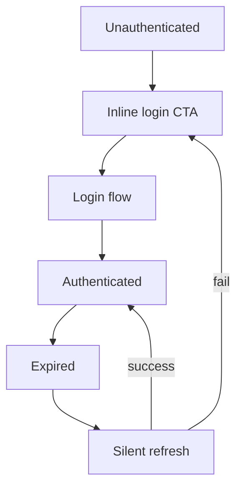
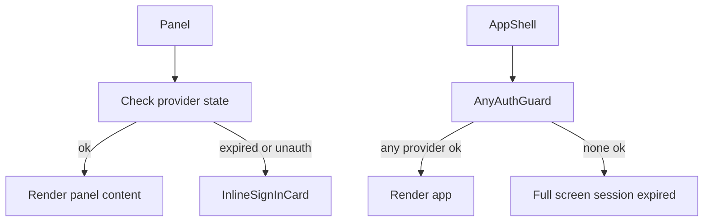

# Auth architecture proposal: per-provider inline login and global fallback

Decision
- Use per-panel inline login prompts for panels bound to an unauthenticated or expired provider session.
- Show a full-screen session expired view only when neither Spotify nor Tidal is authenticated.
- Keep legacy behavior behind a feature flag to enable gradual rollout.

Primary goals
- Decouple provider auth state from global app state so mixed-provider screens are first-class.
- Normalize auth error taxonomy across Spotify and Tidal.
- Provide predictable rendering guards for both panel-level and app-level.
- Avoid storing provider tokens in client state; keep a minimal, event-driven status model on the client.

Non-goals
- Implement multi-account per provider.
- Replace provider-specific login flows; we reuse existing flows.

Feature flag
- Env: `ALLOW_PER_PANEL_INLINE_LOGIN=true|false` declared in [.env.example](.env.example). Client gate is read in [lib/utils.ts](lib/utils.ts).

Key modules and contracts
- Shared provider model definitions in [lib/providers/types.ts](lib/providers/types.ts)
  - [TypeScript.type ProviderId](lib/providers/types.ts:1): 'spotify' | 'tidal'
  - [TypeScript.type ProviderAuthCode](lib/providers/types.ts:1): 'ok' | 'unauthenticated' | 'expired' | 'invalid' | 'insufficient_scope' | 'network' | 'rate_limited' | 'provider_unavailable'
  - [TypeScript.interface ProviderAuthState](lib/providers/types.ts:1): { provider: ProviderId; code: ProviderAuthCode; canAttemptRefresh: boolean; updatedAt: number }
  - [TypeScript.interface ProviderAuthSummary](lib/providers/types.ts:1): { spotify: ProviderAuthState; tidal: ProviderAuthState; anyAuthenticated: boolean }

- Error taxonomy in [lib/providers/errors.ts](lib/providers/errors.ts)
  - [TypeScript.class ProviderAuthError](lib/providers/errors.ts:1): fields { provider: ProviderId; code: ProviderAuthCode; message: string; retryAfterMs?: number }
  - [TypeScript.function isAuthError(err)](lib/providers/errors.ts:1) → boolean

- Client-side registry in [lib/providers/authRegistry.ts](lib/providers/authRegistry.ts)
  - [TypeScript.class ProviderAuthRegistry](lib/providers/authRegistry.ts:1)
    - Holds ephemeral ProviderAuthState per provider (no tokens), persisted across reload via server snapshot.
    - Methods
      - [TypeScript.function getState(provider)](lib/providers/authRegistry.ts:1) → ProviderAuthState
      - [TypeScript.function getSummary()](lib/providers/authRegistry.ts:1) → ProviderAuthSummary
      - [TypeScript.function setState(next)](lib/providers/authRegistry.ts:1)
      - [TypeScript.function onChange(listener)](lib/providers/authRegistry.ts:1) → unsubscribe
      - [TypeScript.function hydrateFromServer(summary)](lib/providers/authRegistry.ts:1)
    - Side-effects
      - Emits events to listeners on transitions.
      - Integrates with logging in [lib/auth/authLogging.ts](lib/auth/authLogging.ts)

- Hooks
  - [hooks/auth/useAuth.ts](hooks/auth/useAuth.ts)
    - [TypeScript.function useAuthSummary()](hooks/auth/useAuth.ts:1) → ProviderAuthSummary
    - [TypeScript.function useProviderAuth(provider)](hooks/auth/useAuth.ts:1) → ProviderAuthState
  - [hooks/auth/useEnsureValidToken.ts](hooks/auth/useEnsureValidToken.ts)
    - [TypeScript.function useEnsureValidToken(provider, opts)](hooks/auth/useEnsureValidToken.ts:1)
      - Tries silent refresh when canAttemptRefresh is true, debounced and guarded per provider.
      - Emits authLogging events for refresh attempts.

- UI components
  - [components/auth/InlineSignInCard.tsx](components/auth/InlineSignInCard.tsx)
    - Props: { provider: ProviderId; reason: ProviderAuthCode; onSuccess?: () => void }
    - Renders provider-themed CTA and short copy. Action triggers existing login flow with redirect back to the originating panel route+state.
  - [components/auth/ProviderPanelGuard.tsx](components/auth/ProviderPanelGuard.tsx)
    - Usage: wrap any panel tied to a single provider.
    - Logic: uses useProviderAuth(provider) and useEnsureValidToken to attempt silent recovery; if unauth/expired shows InlineSignInCard; otherwise renders children.
  - [components/auth/AnyAuthGuard.tsx](components/auth/AnyAuthGuard.tsx)
    - Usage: wrap AppShell body in a guard that checks if any provider is authenticated. If none, show full-screen session-expired with provider login options. Else render children.

- API and server contracts
  - Status endpoint: [app/api/auth/status/route.ts](app/api/auth/status/route.ts)
    - Returns ProviderAuthSummary computed from session or provider SDKs.
  - Standard error shape for auth issues returned by all API routes
    - `{ authError: true, provider: ProviderId, code: ProviderAuthCode, message, retryAfterMs? }`
    - Implemented in handlers using helpers in [lib/api/errorHandler.ts](lib/api/errorHandler.ts)
  - Spotify-specific mapping delegates to unified handler from [lib/api/spotifyErrorHandler.ts](lib/api/spotifyErrorHandler.ts)
  - Tidal transport maps HTTP responses to ProviderAuthError in [lib/music-provider/tidalTransport.ts](lib/music-provider/tidalTransport.ts)

- Client error handling
  - Centralize response error normalization in [lib/api/client.ts](lib/api/client.ts) by transforming provider responses or thrown errors into ProviderAuthError when applicable, then push state to ProviderAuthRegistry.

Integration points in the current codebase
- Replace panel-level hard stops with [components/auth/ProviderPanelGuard.tsx](components/auth/ProviderPanelGuard.tsx) where applicable:
  - Split editor panels: [components/split-editor/index.ts](components/split-editor/index.ts)
  - Playlist panels and hooks: [hooks/usePlaylistPanelState.ts](hooks/usePlaylistPanelState.ts)
  - Player and Spotify-specific components: [components/player/SpotifyPlayer.tsx](components/player/SpotifyPlayer.tsx), [hooks/useSpotifyPlayer.ts](hooks/useSpotifyPlayer.ts)
- Wrap shell content with [components/auth/AnyAuthGuard.tsx](components/auth/AnyAuthGuard.tsx) in [components/shell/AppShell.tsx](components/shell/AppShell.tsx)
- Ensure API callers route auth errors through [lib/api/errorHandler.ts](lib/api/errorHandler.ts) and [lib/api/client.ts](lib/api/client.ts)

State flow
- Per-provider auth state machine

- Rendering decision

Proposed APIs
- [TypeScript.type ProviderId](lib/providers/types.ts:1)
  - 'spotify' | 'tidal'
- [TypeScript.interface ProviderAuthState](lib/providers/types.ts:1)
  - provider: ProviderId
  - code: ProviderAuthCode
  - canAttemptRefresh: boolean
  - updatedAt: number
- [TypeScript.class ProviderAuthRegistry](lib/providers/authRegistry.ts:1)
  - getState(provider): ProviderAuthState
  - getSummary(): ProviderAuthSummary
  - setState(next): void
  - onChange(listener): () => void
  - hydrateFromServer(summary): void
- [TypeScript.function useProviderAuth(provider)](hooks/auth/useAuth.ts:1) → ProviderAuthState
- [TypeScript.function useEnsureValidToken(provider, opts)](hooks/auth/useEnsureValidToken.ts:1) → { ensuring: boolean }
- [TypeScript.function mapApiErrorToProviderAuthError(err)](lib/api/errorHandler.ts:1) → ProviderAuthError | null

Server responsibilities
- The status endpoint [app/api/auth/status/route.ts](app/api/auth/status/route.ts) reports provider states without revealing tokens.
- Each route in app/api/* uses a helper to catch provider SDK exceptions, map them to the standard auth error shape, and set relevant HTTP status codes (401 unauthenticated, 403 insufficient_scope, 429 rate_limited).

Client responsibilities
- Bootstrap: on app load, fetch status summary and hydrate the registry.
- On any API call failure, map and publish ProviderAuthError to the registry.
- Guards subscribe to registry and re-render accordingly.
- InlineSignInCard triggers provider login with redirect back to the panel context.

Login flows and redirects
- CTA builds a redirect URL encoded with the panel context (path and panel identifiers) so that on provider callback, the app restores the original view.
- Spotify: reuse existing flow in [lib/auth/auth.ts](lib/auth/auth.ts) and routes under app/api/auth/spotify/* if present.
- Tidal: reuse existing BYOK or OAuth flow as implemented in [lib/music-provider/tidalProvider.ts](lib/music-provider/tidalProvider.ts) and [lib/music-provider/tidalTransport.ts](lib/music-provider/tidalTransport.ts).

Observability
- Extend [lib/auth/authLogging.ts](lib/auth/authLogging.ts) with new events
  - inline_login_shown { provider, reason }
  - inline_login_clicked { provider }
  - token_refresh_attempted { provider }
  - token_refresh_succeeded { provider }
  - token_refresh_failed { provider }

Migration plan
- Add ALLOW_PER_PANEL_INLINE_LOGIN flag default true for dev, false for prod initially.
- Integrate AnyAuthGuard and ProviderPanelGuard in non-invasive areas first (read-only panels), then extend to player and editing panels.
- Remove legacy global session-expired blocks from [components/player/SpotifyPlayer.tsx](components/player/SpotifyPlayer.tsx) and any similar components after guards are broadly adopted.

Testing strategy
- Unit tests
  - ProviderAuthRegistry state transitions and listeners.
  - Error mapping from Spotify and Tidal transports to ProviderAuthError in [lib/api/errorHandler.ts](lib/api/errorHandler.ts) and [lib/music-provider/tidalTransport.ts](lib/music-provider/tidalTransport.ts).
  - Hooks behavior for useEnsureValidToken and useProviderAuth.
- Component tests
  - ProviderPanelGuard renders InlineSignInCard when state is unauth or expired.
  - AnyAuthGuard shows full-screen when both providers unauthenticated.
- Integration tests
  - Mixed state: left panel Tidal expired, right panel Spotify ok → only left shows inline login.
  - No providers logged in → full-screen session expired redirects to landing.
  - Refresh success path returns to content without user interaction.

Security notes
- Do not store or expose tokens in client registry; use server routes for any token operations.
- Use HTTP-only cookies for session, and gate status with minimal booleans.

Performance considerations
- Keep registry small and event-driven to avoid excessive re-renders.
- Debounce refresh attempts and prevent loops with backoff.

Risks and mitigations
- Risk: conflicting legacy session-expired UIs → Mitigation: audit and remove behind feature flag.
- Risk: inconsistent server error shapes → Mitigation: introduce shared helpers and tests in app/api/*.

Next steps
- Execute the todo list tracked in the task system. See items referencing files such as [lib/auth/auth.ts](lib/auth/auth.ts), [lib/api/errorHandler.ts](lib/api/errorHandler.ts), [lib/music-provider/tidalTransport.ts](lib/music-provider/tidalTransport.ts), [components/shell/AppShell.tsx](components/shell/AppShell.tsx), [components/player/SpotifyPlayer.tsx](components/player/SpotifyPlayer.tsx).