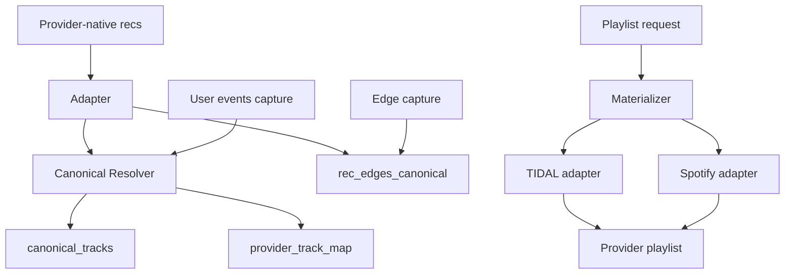
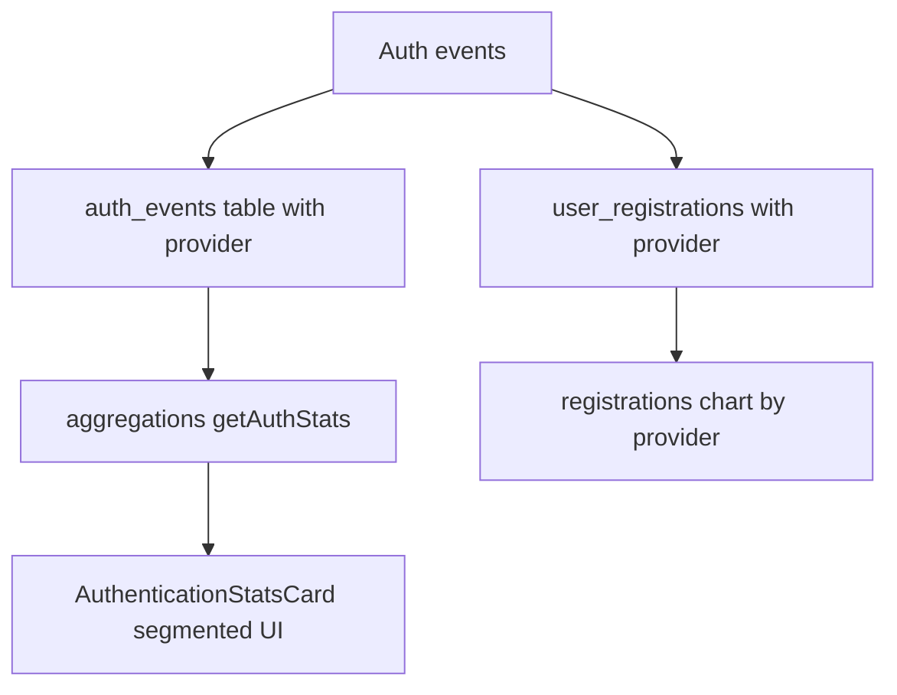

# Multi-Provider Architecture Plan: Stats Enhancements and Cross-Provider Recommendations

Status: Proposed
Owner: Kilo Code
Scope: Add provider awareness to stats UI and make recommendation capture and playlist materialization work across Spotify and TIDAL

## Context and Current State

- Stats stack exists with allowlisting and multiple endpoints:
  - Overview, events, registrations, users, traffic, auth: [app/api/stats/overview/route.ts](/app/api/stats/overview/route.ts), [app/api/stats/events/route.ts](/app/api/stats/events/route.ts), [app/api/stats/registrations/route.ts](/app/api/stats/registrations/route.ts), [app/api/stats/users/route.ts](/app/api/stats/users/route.ts), [app/api/stats/traffic/route.ts](/app/api/stats/traffic/route.ts), [app/api/stats/sessions/route.ts](/app/api/stats/sessions/route.ts)
  - Recs stats: [app/api/stats/recs/route.ts](/app/api/stats/recs/route.ts)
  - Allowlist and config: [lib/metrics/env.ts](/lib/metrics/env.ts), helper: [app/api/debug/whoami/route.ts](/app/api/debug/whoami/route.ts)
- Stats UI: [components/admin/sections/StatsSection.tsx](/components/admin/sections/StatsSection.tsx), [components/stats](/components/stats)
  - Authentication card: [components/stats/cards/AuthenticationStatsCard.tsx](/components/stats/cards/AuthenticationStatsCard.tsx)
  - Recs card: [components/stats/cards/RecsStatsCard.tsx](/components/stats/cards/RecsStatsCard.tsx)
- Metrics persistence: SQLite via [lib/metrics/db.ts](/lib/metrics/db.ts) and migrations in [lib/db/metrics-migrations.ts](/lib/db/metrics-migrations.ts)
- Matching engine (for cross-provider identity): [lib/matching/matchEngine.ts](/lib/matching/matchEngine.ts), [lib/matching/providers.ts](/lib/matching/providers.ts), [lib/matching/scoring.ts](/lib/matching/scoring.ts)
- Recommendation capture and storage:
  - API: [app/api/recs/capture/route.ts](/app/api/recs/capture/route.ts)
  - Core: [lib/recs/index.ts](/lib/recs/index.ts), [lib/recs/capture.ts](/lib/recs/capture.ts), [lib/recs/edges.ts](/lib/recs/edges.ts), [lib/recs/score.ts](/lib/recs/score.ts)
  - Schema: [lib/recs/schema.sql](/lib/recs/schema.sql)

Gaps identified:
- Stats do not show provider context in authentication metrics and possibly in language-related counts.
- Recs are stored and surfaced without a formal provider-agnostic canonical identity, making cross-provider playlist creation unreliable.

## Design Goals

1. Provider-aware stats
   - Display provider on authentication KPIs and charts
   - Provider-scoped views for language-related metrics (see Open Questions)
2. Cross-provider recommendations
   - Store recommendations using provider-agnostic canonical entity IDs
   - Materialize provider-specific playlists by resolving canonical IDs to provider IDs with high-fidelity matching and fallbacks
3. Minimal user friction
   - Clear provider context badges in UI (Spotify, TIDAL)
4. Operational safety
  - Feature flag rollout, deployment-time rec DB reset, monitoring, and graceful degradation

## Decision: Canonical IDs vs Recommendation Provider Abstraction

- There is no single universal track ID across providers. ISRC is widely available but imperfect due to re-issues, regional variants, and non-music content. Spotify and TIDAL expose ISRC for many tracks, but coverage is not 100%.
- Adopt a canonical entity model with multi-signal mapping:
  - Primary key: canonical_track_id (internal)
  - Signals: ISRC, UPC for album, normalized artist name tokens, normalized title tokens, duration seconds, optional release year
  - Mapping table per provider with scoring metadata and freshness
- Avoid a bespoke recommendation system provider for now. Keep the rec engine provider-agnostic and add a provider-specific materialization layer.

Rationale:
- Canonical storage maximizes reuse across providers and avoids double work in the rec graph.
- Provider-specific materialization isolates rate limits and search quirks without infecting core rec logic.

## Data Model Changes

Introduce canonical and mapping tables; avoid breaking existing schema by additive migrations.

- New tables (SQLite in the recs DB):
  - canonical_tracks
    - id TEXT PRIMARY KEY (UUID)
    - isrc TEXT NULL
    - title_norm TEXT NOT NULL
    - artist_norm TEXT NOT NULL
    - duration_sec INTEGER NULL
    - album_upc TEXT NULL
    - created_at TEXT
    - updated_at TEXT
  - provider_track_map
    - provider TEXT NOT NULL CHECK(provider IN ('spotify','tidal'))
    - provider_track_id TEXT NOT NULL
    - canonical_track_id TEXT NOT NULL REFERENCES canonical_tracks(id)
    - isrc TEXT NULL
    - match_score REAL NOT NULL
    - confidence TEXT NOT NULL CHECK(confidence IN ('high','medium','low'))
    - resolved_at TEXT NOT NULL
    - UNIQUE(provider, provider_track_id)
  - rec_edges_canonical
    - src_canonical_track_id TEXT NOT NULL REFERENCES canonical_tracks(id)
    - dst_canonical_track_id TEXT NOT NULL REFERENCES canonical_tracks(id)
    - weight REAL NOT NULL
    - type TEXT NOT NULL CHECK(type IN ('sequential','cooccur'))
    - created_at TEXT NOT NULL
    - PRIMARY KEY(src_canonical_track_id, dst_canonical_track_id, type)

- Metrics DB changes (add provider dimension):
  - auth_events
    - Add provider TEXT NULL CHECK(provider IN ('spotify','tidal'))
  - user_registrations
    - Add provider TEXT NULL
  - events or users table where language counts originate (see Open Questions)

Additive migrations to be appended in [lib/recs/schema.sql](/lib/recs/schema.sql) and [lib/db/metrics-migrations.ts](/lib/db/metrics-migrations.ts).

## Resolver Service

Create a service that translates between provider IDs and canonical IDs, reusing matching engine heuristics.

- Module: lib/resolver/canonicalResolver.ts (new)
- Responsibilities:
  - fromProviderTrack(provider, provider_track_id) -> canonical_track_id
    - Lookup in provider_track_map
    - If miss, fetch metadata via provider API, compute normalized tokens, attempt ISRC match; if still miss, run [lib/matching/matchEngine.ts](/lib/matching/matchEngine.ts) scoring against catalog search results
    - Insert or update provider_track_map with match_score and confidence
  - toProviderTrack(provider, canonical_track_id) -> provider_track_id | null
    - Lookup mapping; if miss or low-confidence stale, attempt refresh via provider search
  - Batch resolve utilities for materialization
- Normalization utilities can live in lib/resolver/normalize.ts (new) and reuse [lib/utils.ts](/lib/utils.ts) where applicable.

## Recommendation Storage Migration

- Capture path: [app/api/recs/capture/route.ts](/app/api/recs/capture/route.ts) calls [lib/recs/capture.ts](/lib/recs/capture.ts)
- Update capture to:
  - Resolve incoming provider track IDs to canonical_track_id via Resolver
  - Write edges to rec_edges_canonical instead of provider-specific IDs

Migration plan (simplified):
- Do not backfill legacy recommendation edges.
- Wipe/recreate the recs DB at deployment for canonical rollout.
- Start fresh with canonical capture under feature flag RECS_CANONICAL_MODE=true.
- Let recommendation quality re-learn from new captures post-deploy.

## Playlist Materialization Layer

- New module: lib/recs/materialize.ts
- Input: list of canonical_track_id ordered by weight or rank
- Output: provider-specific track ID list
- Algorithm:
  1. For each canonical id, attempt direct mapping with confidence high
  2. If missing or low confidence, attempt provider search using normalized tokens and optional ISRC
  3. Validate via duration tolerance window (±2s) and artist match
  4. De-dupe by provider_track_id and artist-title
  5. Log rate-limit backoff and surface partial results
- Provide per-provider adapters that wrap existing API client in [lib/api/client.ts](/lib/api/client.ts)

## Stats Enhancements: Provider Awareness

- Auth stats
  - Extend ingestion code to record provider in auth_events
  - Update [lib/metrics/aggregations.ts](/lib/metrics/aggregations.ts) getAuthStats to group by provider and BYOK where relevant
  - Update [components/stats/cards/AuthenticationStatsCard.tsx](/components/stats/cards/AuthenticationStatsCard.tsx) to display segmented bars and provider badges
- Language counts
  - If language is UI locale from traffic analytics, compute by provider user sessions if available
  - If language is track language detection, add pipeline stage and table for track language then group by provider via materialization source
  - Add API params provider=spotify|tidal for endpoints where scope makes sense

## API Changes

- Stats endpoints: optional provider query param where relevant
  - /api/stats/auth: returns overall plus per-provider breakdown arrays
  - /api/stats/users: support filter by provider
  - /api/stats/overview: include provider breakdown KPIs
- Recs endpoints (if exposed in future) should accept provider for materialization

## UI Changes

- Global provider badges in admin stats header
  - Add provider filter toggle chips in [components/admin/sections/StatsSection.tsx](/components/admin/sections/StatsSection.tsx)
- Authentication card
  - Segmented stacked bars per day by provider
  - Totals by provider with Spotify and TIDAL icons from [public/spotify](/public/spotify) and [public/tidal](/public/tidal)
- Language counts card (depending on source)
  - Show provider-scoped rows

## Feature Flags and Config

- STATS_PROVIDER_DIMENSION=true enables provider grouping in stats
- RECS_CANONICAL_MODE=true enables canonical rec storage and materialization
- RECS_USE_PROVIDER_NATIVE=true enables fetching provider-native recommendations when available
- Guard UI conditionally to avoid breaking stats for deployments without new schema

## Observability

- Add structured logs around resolver decisions and confidence
- Metrics:
  - Resolver hit rate, miss rate, average latency
  - Materialization success rate per provider and per 10 tracks
  - Rate-limit events and retries
  - Provider-native rec usage rate, latency, and blend contribution

## Testing

- Unit tests
  - Resolver: high, medium, low confidence scenarios, fallbacks
  - Materializer: de-dupe, duration tolerance, search fallback
  - Metrics aggregations: provider grouping and totals consistency
  - Provider-native adapter stubs for TIDAL to validate transformations
- E2E tests
  - Connect Spotify and TIDAL, generate recs, materialize playlists across providers
  - Stats UI provider filter toggles and segmented auth charts
  - Build on existing: [tests/e2e/providerConnectionUx.e2e.spec.ts](/tests/e2e/providerConnectionUx.e2e.spec.ts), [tests/e2e/tidalSmoke.e2e.spec.ts](/tests/e2e/tidalSmoke.e2e.spec.ts)

## Rollout and Migration Plan

1. Ship schema additions behind flags
2. Deploy resolver and silent mapping population on read paths to warm provider_track_map
3. Wipe/recreate recs DB on deployment (fresh canonical start)
4. Enable STATS_PROVIDER_DIMENSION=true and verify dashboard
5. Enable RECS_CANONICAL_MODE=true for a subset of users
6. Enable RECS_USE_PROVIDER_NATIVE=true for TIDAL-only cohort
7. Monitor, then deprecate old provider-specific rec edges

## Leveraging Provider-Native Recommendations (e.g., TIDAL)

Goal: Use provider-native recommendation endpoints (when user is logged in) to seed and enhance our provider-agnostic graph, while still delivering cross-provider results via canonicalization.

Key ideas:
- Treat provider-native recs as an additional signal source alongside our co-occurrence/sequential graph.
- Convert provider-native rec lists to canonical IDs, store as edges with provenance, and optionally blend at serving time.

Architecture:
- New adapter interface: RecommendationSource (no runtime dependency on app consumers)
  - Methods (conceptual):
    - getTrackRadio(provider: 'tidal'|'spotify', trackId: string, opts: { limit?: number }): Promise<ProviderTrack[]>
    - getArtistRadio(provider: 'tidal'|'spotify', artistId: string, opts?: any): Promise<ProviderTrack[]>
    - getPersonalMix(provider: 'tidal'|'spotify', userId: string, opts?: any): Promise<ProviderTrack[]>
  - Implementation modules (behind feature flag):
    - lib/providers/reco/tidal.ts (uses logged-in TIDAL token via our auth/session layer)
    - lib/providers/reco/spotify.ts (future)
- Flow:
  1) User requests recommendations (seed track/playlist/artist)
  2) If RECS_USE_PROVIDER_NATIVE=true and provider token is present, call provider adapter to fetch native recs
  3) Resolve each returned provider track to canonical via Resolver
  4) Store edges with provenance source='provider_native' and provider='tidal' and a calibrated edge weight
  5) Blend: combine graph-based recs and provider-native recs using weighted rank aggregation; de-duplicate by canonical
  6) Materialize to requested target provider via materializer

Provenance and storage:
- Extend rec edges input path in [lib/recs/capture.ts](/lib/recs/capture.ts) to accept a "source" metadata field; default 'graph', new 'provider_native'
- Option A: A dedicated table rec_edges_provenance(provider, src_canonical, dst_canonical, weight, source, ts)
- Option B: Add source and provider columns to rec_edges_canonical (preferred if SQLite indices remain performant)

Auth and permissions:
- Only call provider-native endpoints for the provider(s) the current user is connected to
- Respect scopes and rate limits; cache results with TTL (e.g., 12h) in a small KV or SQLite table to reduce pressure

Blending strategy (serving):
- Weighted blending with tunable params (feature flags):
  - w_graph = 0.7, w_native = 0.3 initial defaults
- Normalize scores per source (min-max or z-score) and sum weighted scores
- Tie-break using popularity or recency

Cold start and fallback:
- If our graph is sparse for a user/seed, up-weight provider-native results temporarily
- If provider-native call fails or token is missing, continue with graph-only

API surface (internal first):
- Optional route for debugging: [app/api/recs/provider/route.ts](/app/api/recs/provider/route.ts)
  - GET /api/recs/provider?provider=tidal&seedType=track&seedId=...&limit=50
  - Returns provider-native recs plus their canonical mappings for inspection

UI considerations:
- In the recommendations module, display a small badge “Enhanced by TIDAL” when provider-native blending is active
- Add a toggle in advanced settings to enable/disable “Use provider-native recommendations”

Observability:
- Log adapter latency, success/failure, rate-limit responses
- Track contribution share: percentage of final list contributed by provider-native vs graph

Testing:
- Stub adapter against [docker/mock/tidal-server.js](/docker/mock/tidal-server.js)
- Contract tests that ensure results convert to canonical and de-duplicate correctly

Compliance and privacy:
- Do not persist the raw provider-native list beyond TTL cache unless user opted in to “improve recommendations”
- Persist only canonicalized edges with minimal metadata

## Mermaid: High-Level Flow

## Mermaid: Stats Provider Dimension

## Open Questions

- Language counts source of truth
  - If it refers to UI language, we need to attribute sessions to provider identities or show overall only
  - If it refers to track language, we need a detection pipeline and a place to store per track
- Provider preference order for materialization when a canonical maps to multiple candidates with similar score
- Confidence thresholds for auto-accepting mappings and when to prompt user or log warning
- Provider-native adapter availability and endpoint guarantees (TIDAL/Spotify APIs may change)

## Implementation Checklist (Cross-Referenced with Todos)

- Schema and types
  - Add new canonical and mapping tables to [lib/recs/schema.sql](/lib/recs/schema.sql)
  - Add provider columns in metrics migrations at [lib/db/metrics-migrations.ts](/lib/db/metrics-migrations.ts)
  - Extend shared stats types in [components/stats/types.ts](/components/stats/types.ts)
- Resolver and materializer
  - New modules in lib/resolver and lib/recs/materialize.ts
  - Wire into [lib/recs/capture.ts](/lib/recs/capture.ts) and [lib/recs/index.ts](/lib/recs/index.ts)
- Aggregations and APIs
  - Update [lib/metrics/aggregations.ts](/lib/metrics/aggregations.ts)
  - Update stats API routes to accept provider param and return breakdowns
  - Add debug route [app/api/recs/provider/route.ts](/app/api/recs/provider/route.ts)
- UI
  - Provider filter chips and badges in [components/admin/sections/StatsSection.tsx](/components/admin/sections/StatsSection.tsx)
  - Segmented auth chart and totals in [components/stats/cards/AuthenticationStatsCard.tsx](/components/stats/cards/AuthenticationStatsCard.tsx)
  - Language counts card scoped by provider as decided
  - “Enhanced by TIDAL” badge/toggle in recs UI
- Feature flags and docs
  - Document flags in README and .env.example
- Tests and telemetry
  - Expand unit and e2e suites; add resolver logs and metrics; adapter stubs

End of plan.